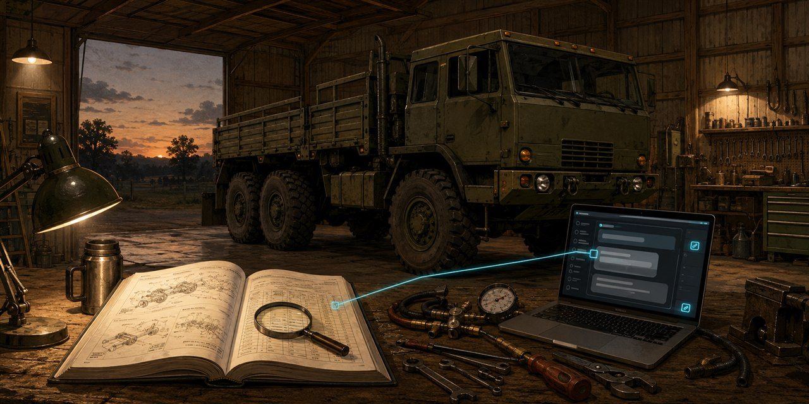
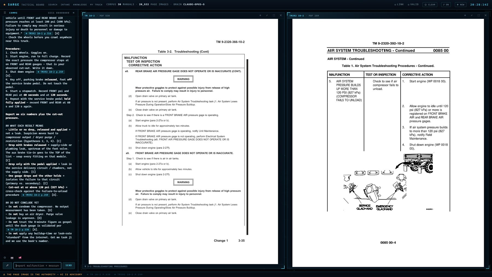
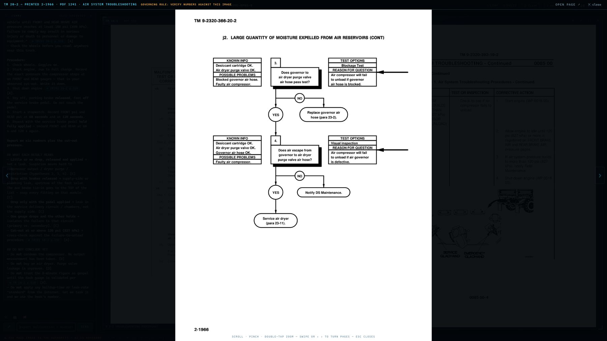
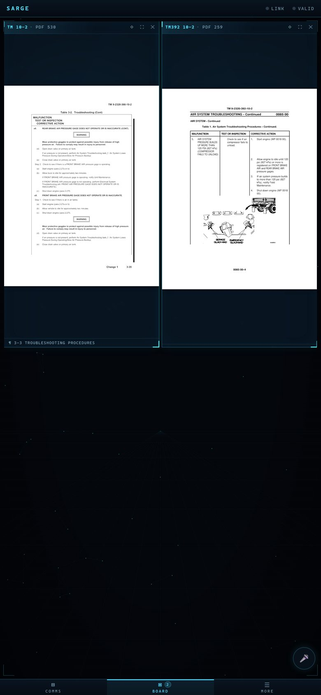
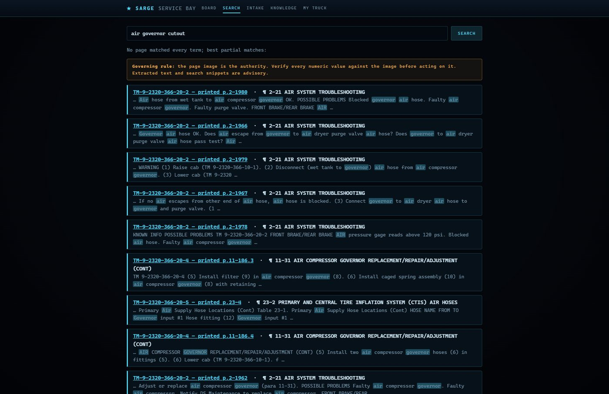

# SARGE — Search-Augmented Retrieval, Grounded Evidence

*The motor sergeant who quotes you the page number and makes you verify it yourself.* An owner-technician diagnostic and manual-search system, built for FMTV trucks.

Built around a 2003 M1083A1; works for any LMTV/MTV variant — or, with your own manuals, any documented vehicle.



**The idea:** AI is genuinely useful for vehicle diagnosis, but no AI model
can be trusted with torque specs and brake procedures. This system enforces
that architecturally:

- Specs come **only** from your indexed technical manuals, and every numeric
  claim is cited to a **page image** you verify with your own eyes.
- A validation pass runs on every AI answer: citations that don't exist in
  the index and numbers that don't appear in cited pages get flagged in red.
- Your truck's **as-built deviations** (converted hubs, electrical mods, added
  equipment) are a first-class input — the AI reasons about *your* truck, not
  the stock TM assumption.
- Works with the Claude API (best) or a local Ollama model (offline fallback,
  same grounding and validation).

> ## ⚠️ Safety disclaimer
> This is a hobbyist reference tool, not a certified maintenance system.
> AI output — even validated — is **advisory only**. The applicable technical
> manual and your own measurements are authoritative. Verify every
> specification against the rendered manual page image before acting on it.
> Air brakes, spring brakes, and heavy-vehicle work can kill; follow the
> TM's safety steps and your own judgment. No warranty of any kind (see
> LICENSE).

## What it looks like

**The tactical board** — SARGE's interface. Every page the AI cites deploys
onto the evidence wall as the *actual page image*. The AI points at the
manual; it never replaces it:



| Full-screen viewer — zoom, then turn real manual pages | Phone — same session, board view |
|---|---|
|  |  |

- **Board** (the default view) — a diagnosis conversation on the left, a
  live evidence wall on the right. Cited pages deploy as panels (or tap any
  citation chip to deploy it yourself); one tap brings a page forward full
  screen, where you zoom with scroll/pinch/double-tap and swipe or arrow
  through the *actual manual*. Pin what matters, sweep the rest. Any number
  of screens — wall tablet, phone under the truck, laptop — join the same
  session over the LAN and mirror live. Validation results print under
  every answer; the panel state survives restarts.
- **Voice** — hold-to-talk, or open-mic **full duplex** with barge-in
  (talk over SARGE to interrupt), "stop" to cut playback, and an optional
  *"SARGE, …"* wake word. Substantial answers are **spoken as a short
  brief** — what was found, what just landed on the board, the one next
  step — while the full workup renders on screen only. The spoken channel
  never carries a spec number: SARGE deploys the page and has you read the
  value off the board with your own eyes. Free out of the box (the
  browser's built-in speech engines); set `ELEVENLABS_API_KEY` in your
  environment for a premium voice — pay-per-use on your own key, which
  never leaves your machine.
- **Search** — direct manual search across the whole corpus, every hit
  linked to its page image.



- **Intake** — a structured complaint form (category-adaptive measurement
  fields) that files a record and auto-starts a board diagnosis.
- **Help post** — 📢 drafts an honest, structured "call for help" for a
  forum or owners group from the current session.

## Setup — the easy way (Windows, no software knowledge needed)

1. Click the green **Code** button above → **Download ZIP** → unzip anywhere
2. Double-click **`setup.bat`** — it checks Python (helps you install it if
   missing), sets everything up, downloads the manual index, and asks a few
   plain questions
3. From then on: double-click **`run.bat`** to start SARGE

Then open the **My truck** page and describe your truck — dropdowns, no
file editing. The AI can only account for modifications you record.

## Setup — the manual way

Requirements: Python 3.11+, ~2 GB disk per 10k manual pages, an
[Anthropic API key](https://platform.claude.com) for online diagnosis
(optional: [Ollama](https://ollama.com) for offline mode).

```sh
git clone https://github.com/mooka01/sarge && cd sarge
pip install -r requirements.txt
```

**1. Get the knowledge. FMTV owners have a fast path:**

```sh
python bootstrap_fmtv.py                 # MTV 6x6 (M1083 series, TM -366)
python bootstrap_fmtv.py --variant lmtv  # LMTV 4x4 (M1078 series, TM -365)
```

downloads the complete public-domain Army TM set for your variant (~1.2–1.4
GB) and builds the search index locally (30–60 min). Even faster: grab the **prebuilt TM index**
from this repo's Releases page (~60 MB, public-domain content only), place it
at `corpus/index.sqlite`, and search works immediately. Download the PDFs
(`python bootstrap_fmtv.py`) whenever convenient to enable the page-image
authority layer — until then, page-image links explain what's missing.

Other vehicles: put your own PDFs in `corpus/raw/` and run:

```sh
python ingest/ingest_tm.py corpus/raw/*.pdf   # text + metadata + FTS index
python ingest/embed_index.py                  # semantic vectors (local, CPU)
```

Copyrighted factory documents (Cat, Allison, WABCO…) are never included in
this repo or its releases — acquire your own copies (options in SOURCES.md)
and add them via the web app's **Knowledge** page.

**2. Describe your truck.** Open the **My truck** page in the app —
dropdowns and guided fields for variant, powertrain, deviations from stock,
electrical mods, and RV/habitat equipment. What you record there is injected
into every diagnosis; it's why the AI won't quote stock procedures at your
modified truck. (Starts blank — assumed stock until you say otherwise.)

**3. Run.**

```sh
set ANTHROPIC_API_KEY=sk-ant-...   # or use Ollama offline mode
set ELEVENLABS_API_KEY=...         # optional premium voice; omit = free browser voice
python app.py                      # → http://127.0.0.1:8383
```

Voice input uses the browser's free speech engine (Chrome/Edge/Android;
iOS is unreliable) and requires a secure context — `localhost` works as-is;
to use the mic from a phone on the LAN/Tailscale, serve over HTTPS (e.g.
Tailscale's built-in certs). Spoken replies work everywhere.

CLI equivalents: `query.py` (search), `diagnose.py` (one-shot test card,
`--forums` adds live Steel Soldiers search), `compare.py` (A/B a question
through Claude and a local model over identical context).

## Architecture (short version)

```
PDFs → ingest (per-page text, printed page numbers, paragraph headings)
     → SQLite: FTS5 keyword index + fastembed vectors  (all local)
query → hybrid retrieval (rank fusion)
      → Claude / Ollama, restricted to retrieved pages + as-built dossier
      → validation: citations exist? numbers verbatim in cited pages?
      → board: answer + flags; cited pages deploy as page-image panels,
        SSE-synced to every screen on the session
voice → browser ASR (push-to-talk / open mic / wake word)
      → same pipeline, same validation
      → spoken BRIEF (never a spec number) + on-screen detail;
        TTS = free browser voice, or ElevenLabs via a local key-safe relay
```

Design rationale, tier system (TM > forums > anecdotes), and roadmap:
[PROJECT_BRIEF.md](PROJECT_BRIEF.md).

## Corpus policy

The published indexes contain public-domain Distribution A manuals
exclusively — see `ingest/export_public_index.py`. Nothing under a
restrictive distribution statement or export marking is ever committed to
this repo or attached to a release. This project does not solicit or accept
document contributions.

## License

MIT — see [LICENSE](LICENSE). Manual PDFs are not part of this project and
carry their own copyrights.
